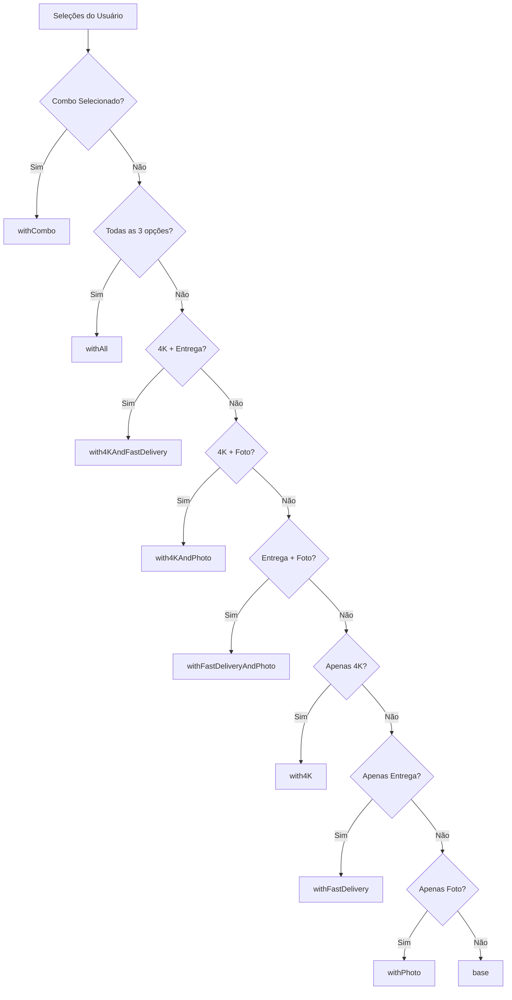

# 💰 Resumo Executivo - Sistema de Preços

## 🎯 Estratégia de Preços

### 🌍 Segmentação Regional
- **🇧🇷 Brasil (LastLink)**: Preços premium em BRL
- **🌎 Internacional (CartPanda)**: Preços competitivos em USD

### 📊 Estrutura de Preços

#### Produtos Base
```
1 Criança:  R$ 49,99 (BR) | $24.99 (INT)
2 Crianças: R$ 59,99 (BR) | $29.99 (INT)  
3+ Crianças: R$ 69,99 (BR) | $34.99 (INT)
```

#### Order Bumps
```
4K Quality:     R$ 12,00 (BR) | $4.99 (INT)
Fast Delivery:  R$ 12,00 (BR) | $2.99 (INT)
Child Photo:    R$ 14,90 (BR) | $4.99 (INT)
Combo All:      R$ 29,99 (BR) | $9.99 (INT)
```

## 🔗 Códigos LastLink por Produto

### 📹 1 Criança (Base: R$ 49,99)
| Complementos | Código | Preço Final |
|--------------|--------|-------------|
| Nenhum | `C0EE44F93` | R$ 49,99 |
| 4K | `CDA6777BF` | R$ 61,99 |
| Entrega Rápida | `C4611BC02` | R$ 61,99 |
| Foto | `C4240D0D9` | R$ 64,89 |
| 4K + Entrega | `CD130B4F2` | R$ 73,99 |
| 4K + Foto | `C9C9B03E3` | R$ 76,89 |
| Entrega + Foto | `CDA157BB1` | R$ 76,89 |
| Todos Individual | `C87D15C87` | R$ 88,89 |
| **Combo** | `CC81F4813` | **R$ 79,98** |

### 📹 2 Crianças (Base: R$ 59,99)
| Complementos | Código | Preço Final |
|--------------|--------|-------------|
| Nenhum | `C93ACA8B6` | R$ 59,99 |
| 4K | `C45ED916B` | R$ 71,99 |
| Entrega Rápida | `CC4DC9AE4` | R$ 71,99 |
| Foto | `C73BCEC41` | R$ 74,89 |
| 4K + Entrega | `CAE24A1A8` | R$ 83,99 |
| 4K + Foto | `C083D7CE5` | R$ 86,89 |
| Entrega + Foto | `CCD33E991` | R$ 86,89 |
| Todos Individual | `C2A46559E` | R$ 98,89 |
| **Combo** | `CD9EFF4C9` | **R$ 89,98** |

### 📹 3+ Crianças (Base: R$ 69,99)
| Complementos | Código | Preço Final |
|--------------|--------|-------------|
| Nenhum | `C81BBAC35` | R$ 69,99 |
| 4K | `C45ED916B` | R$ 81,99 |
| Entrega Rápida | `CF799CB6D` | R$ 81,99 |
| Foto | `C50663D83` | R$ 84,89 |
| 4K + Entrega | `C0AEA4D21` | R$ 93,99 |
| 4K + Foto | `C7C011D46` | R$ 96,89 |
| Entrega + Foto | `C7D6B6AE2` | R$ 96,89 |
| Todos Individual | `C8BAACD7C` | R$ 108,89 |
| **Combo** | `CA196C8C0` | **R$ 99,98** |

## 💡 Insights de Pricing

### 🎁 Economia do Combo
- **1 Criança**: R$ 8,91 de economia (R$ 88,89 → R$ 79,98)
- **2 Crianças**: R$ 8,91 de economia (R$ 98,89 → R$ 89,98)
- **3+ Crianças**: R$ 8,91 de economia (R$ 108,89 → R$ 99,98)

### 📈 Estratégia de Upsell
1. **Combo** oferece economia real (R$ 8,91)
2. **Foto** é o upgrade mais caro (R$ 14,90)
3. **4K e Entrega Rápida** têm mesmo preço (R$ 12,00)
4. **Combo** é mais atrativo que opções individuais

### 🎯 Recomendações
- **Destacar economia do combo** na UI (R$ 8,91 de desconto)
- **Posicionar Foto** como premium (preço mais alto)
- **4K + Entrega** como bundle intermediário
- **Combo** como melhor custo-benefício

## 🔄 Fluxo de Seleção de URL



## 🚀 Implementação Técnica

### 📝 Exemplo de Uso
```typescript
// Usuário selecionou: 2 crianças + 4K + Foto
const selections = {
  childrenCount: 2,
  orderBumps: ['4k-quality', 'child-photo']
};

// Sistema retorna:
const checkoutUrl = 'C083D7CE5'; // with4KAndPhoto
const finalPrice = 79.99; // R$ 59,99 + R$ 12,00 + R$ 8,00
```

### 🔍 Validação
```typescript
const validateCheckout = (product, selections) => {
  // 1. Verificar se produto existe
  // 2. Validar combinações de order bumps
  // 3. Confirmar URL de checkout disponível
  // 4. Calcular preço final
  // 5. Gerar payload para LastLink/CartPanda
};
```

## 📊 KPIs de Monitoramento

### 💰 Métricas de Revenue
- **AOV** (Average Order Value)
- **Uptake Rate** de cada order bump
- **Combo Conversion Rate**
- **Revenue per Visitor**

### 🎯 Métricas de Conversão
- **Abandono por faixa de preço**
- **Time to Purchase**
- **Bounce rate** na página de preços
- **A/B test results** de diferentes preços

### 🌍 Métricas Regionais
- **Performance LastLink vs CartPanda**
- **Conversão por país**
- **Preferências de order bumps** por região
- **Sazonalidade** de preços